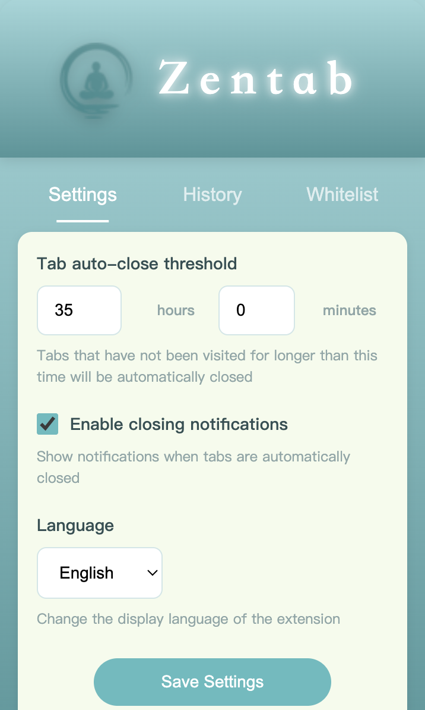
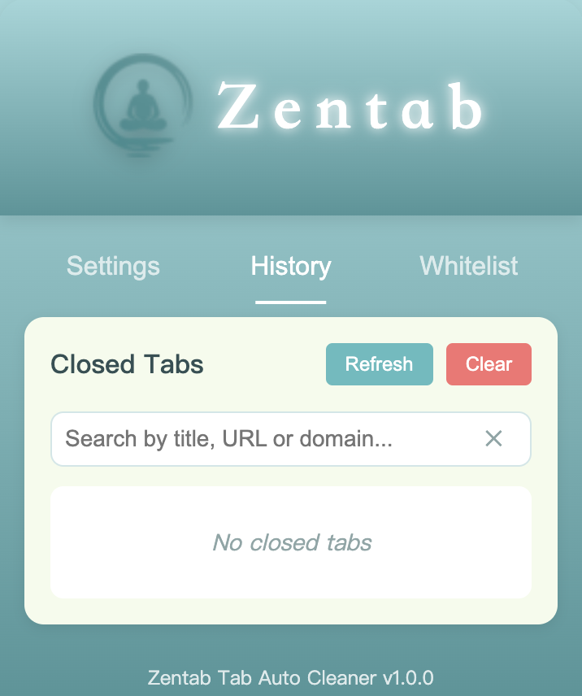
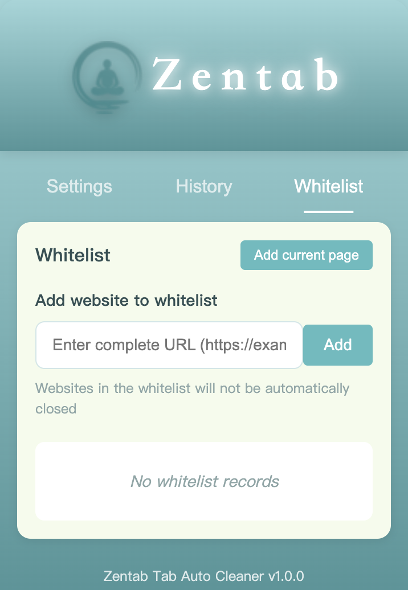

# Zentab Tab Auto Cleaner

  

A browser extension that automatically manages and cleans up tabs that haven't been used for a long time.

[中文文档](#zentab-标签页自动清理器)

## Features

- **Automatic Tab Cleanup**: Automatically closes tabs that haven't been visited for a specified time
- **Customizable Threshold**: Set your own time threshold for automatic tab closure (default: 35 hours)
- **Whitelist Support**: Add important websites to the whitelist to prevent them from being closed
- **Complete History**: View and restore closed tabs with a complete browsing history
- **Multi-language Support**: Available in English, Simplified Chinese, and Traditional Chinese
- **Beautiful UI**: Clean and intuitive interface with gradient design

## Screenshots

  
  
  

## Installation

1. Download the extension from Chrome Web Store [install](https://chromewebstore.google.com/detail/adcckhibigginnidiinpggamipkmmcml?utm_source=item-share-cb)
2. Click "Add to Chrome" to install the extension
3. The Zentab icon will appear in your browser toolbar

### Alternative Installation (Developer Mode)

1. Download the extension source code from GitHub
2. Open Chrome and go to `chrome://extensions/`
3. Enable "Developer mode" in the top right corner
4. Click "Load unpacked" and select the extension source code directory
5. The Zentab icon will appear in your browser toolbar

## Usage

### Setting Tab Cleanup Time

1. Click on the Zentab icon in your browser toolbar
2. In the Settings tab, set your desired inactive threshold (hours and minutes)
3. Click "Save Settings" to apply changes

### Whitelist Management

Add websites to the whitelist to prevent them from being automatically closed:

1. Navigate to the Whitelist tab
2. Enter the complete URL or click "Add current page" to add the current website
3. To remove a website from the whitelist, click the "Remove" button

### History Management

View and restore closed tabs:

1. Navigate to the History tab
2. Browse through closed tabs or use the search function to find specific tabs
3. Click "Restore" to reopen a closed tab
4. Click "Add to whitelist" to add a closed tab's URL to the whitelist

## Privacy

Zentab respects your privacy:
- All data is stored locally in your browser
- No data is sent to external servers
- No tracking or analytics

## License

[MIT License](LICENSE)

---

# Zentab 标签页自动清理器

  

一个浏览器扩展，可自动管理和清理长时间未使用的标签页。

[English Documentation](#zentab-tab-auto-cleaner)

## 功能特点

- **自动清理标签页**：自动关闭长时间未访问的标签页
- **自定义时间阈值**：设置标签页自动关闭的时间阈值（默认：35小时）
- **白名单支持**：将重要网站添加到白名单，防止被自动关闭
- **完整历史记录**：查看和恢复已关闭的标签页，包含完整的浏览历史
- **多语言支持**：支持英文、简体中文和繁体中文
- **精美界面**：干净直观的界面设计，采用渐变色设计

## 截图

  
  
  

## 安装方法

1. 从Chrome网上应用店下载扩展  [立即安装](https://chromewebstore.google.com/detail/adcckhibigginnidiinpggamipkmmcml?utm_source=item-share-cb)
2. 点击"添加到Chrome"安装扩展
3. Zentab图标将出现在浏览器工具栏中

### 替代安装方法（开发者模式）

1. 从GitHub下载扩展源代码
2. 打开Chrome浏览器，访问 `chrome://extensions/`
3. 在右上角启用"开发者模式"
4. 点击"加载已解压的扩展程序"，选择扩展源码目录
5. Zentab图标将出现在浏览器工具栏中

## 使用方法

### 设置标签页清理时间

1. 点击浏览器工具栏中的Zentab图标
2. 在设置标签页中，设置您希望的未活动阈值（小时和分钟）
3. 点击"保存设置"应用更改

### 白名单管理

将网站添加到白名单以防止它们被自动关闭：

1. 导航到白名单标签页
2. 输入完整URL或点击"添加当前页面"添加当前网站
3. 要从白名单中移除网站，点击"移除"按钮

### 历史记录管理

查看和恢复已关闭的标签页：

1. 导航到历史记录标签页
2. 浏览已关闭的标签页或使用搜索功能查找特定标签页
3. 点击"恢复"重新打开已关闭的标签页
4. 点击"加入白名单"将已关闭标签页的URL添加到白名单

## 隐私声明

Zentab尊重您的隐私：
- 所有数据仅存储在您的浏览器本地
- 不会向外部服务器发送任何数据
- 无跟踪或分析

## 许可证

[MIT许可证](LICENSE)
